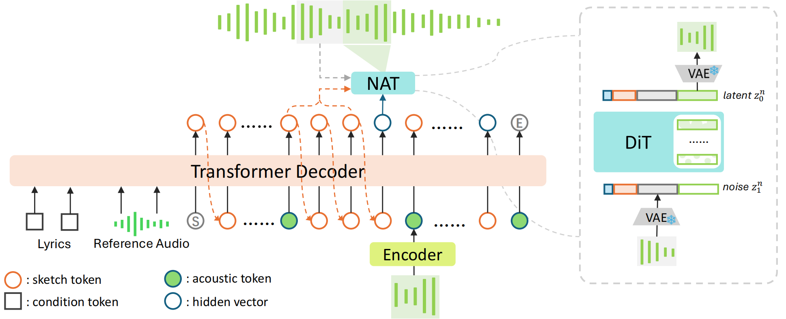

# SongBloom: Coherent Song Generation via Interleaved Autoregressive Sketching and Diffusion Refinement

<div align="center">

[](https://arxiv.org/abs/2506.07634)
[](https://huggingface.co/CypressYang/SongBloom)
[](https://www.apache.org/licenses/LICENSE-2.0)

</div>

We propose **SongBloom**, a novel framework for full-length song generation that leverages an interleaved paradigm of autoregressive sketching and diffusion-based refinement. By combining a high-fidelity diffusion model with a scalable language model, SongBloom gradually extends a musical sketch from short to long and refines details from coarse to fine-grained.

This interleaved paradigm effectively integrates prior semantic and acoustic context to guide the generation process, achieving state-of-the-art results in coherent, full-length song creation.

### ▶️ [**Check out the Demos**](https://cypress-yang.github.io/SongBloom_demo/)



## 🚀 Getting Started

Follow these three simple steps to generate your first song with SongBloom.

### Step 1: Set Up Your Environment

First, clone the repository and set up the Conda environment.

```bash
# Clone the repository
git clone https://github.com/Cypress-Yang/SongBloom.git
cd SongBloom

# Create and activate the Conda environment
conda create -n SongBloom python==3.8.12
conda activate SongBloom

# For Linux, you may need to install libsndfile first
# sudo apt-get install libsndfile1 or sudo yum install libsndfile

# Install all required Python packages
pip install -r requirements.txt
```
> **Note:** The `requirements.txt` file includes a specific version of PyTorch for CUDA 11.8. If you have a different CUDA version, please install the appropriate PyTorch and Torchaudio binaries from the [official site](https://pytorch.org/get-started/previous-versions/).


### Step 2: Prepare Your Songs (`.songbloom` file)

Instead of complex command-line arguments, you define your songs in a simple `.songbloom` file using the human-readable TOML format. Create a file like `my_songs.songbloom`:

```toml
# File: my_songs.songbloom
# Define one or more songs to generate.

[sunset_lullaby]
lyrics = "the sun is setting low and the stars are starting to glow"
prompt_wav = "prompts/my_awesome_prompt.wav" # 10s, 48kHz audio clip
n_samples = 2 # Optional: Number of variations to generate (default is 1)
output_name = "sunset_song_final" # Optional: Filename for the output

[city_rhythm]
lyrics = "walking through the city streets with a rhythm in my feet"
prompt_wav = "inputs/city_beat.mp3"
```
*   The prompt audio should ideally be a **10-second, 48kHz** audio clip.
*   For details on lyric formatting, see [`docs/lyric_format.md`](docs/lyric_format.md).

### Step 3: Generate Music!

Now, run the main script, pointing it to your configuration file. The model and necessary assets will be downloaded automatically on the first run.

```bash
# Basic usage
python3 songbloom.py my_songs.songbloom

# Specify a different output directory
python3 songbloom.py my_songs.songbloom --output-dir "path/to/my/music"

# For GPUs with lower VRAM (e.g., RTX 4090), use bfloat16 for better performance
python3 songbloom.py my_songs.songbloom --dtype bfloat16
```
> **Flash Attention**: To enable flash-attn for a potential speed-up, install the library manually and change `DISABLE_FLASH_ATTN` from `"1"` to `"0"` at the top of `songbloom.py`.


## 📦 Models

All models are available on the [Hugging Face Hub](https://huggingface.co/CypressYang/SongBloom).

| Name                 | Size | Max Length | Prompt type | Link                                         |
| -------------------- | ---- | ---------- | ----------- | -------------------------------------------- |
| `songbloom_full_150s`  | 2B   | 2m 30s     | 10s wav     | [🤗 HF Repo](https://huggingface.co/CypressYang/SongBloom) |
| `songbloom_mulan_150s` | 2B   | 2m 30s     | 10s wav / text | *Coming Soon*                                |

## 📝 TODO List

- [ ] Support Text Description Prompts
- [ ] Release full-length model version


## 📈 Star History

<div align="center">

[](https://star-history.com/#Cypress-Yang/SongBloom&Date)

</div>

## ✨ Contributors

A huge thank you to all the amazing people who have contributed to this project!

<div align="center">

<a href="https://github.com/Cypress-Yang/SongBloom/graphs/contributors">
  
</a>

</div>

## Citation

If you find SongBloom useful in your research, please cite our paper:

```bibtex
@article{yang2025songbloom,
  title={SongBloom: Coherent Song Generation via Interleaved Autoregressive Sketching and Diffusion Refinement},
  author={Yang, Chenyu and Wang, Shuai and Chen, Hangting and Tan, Wei and Yu, Jianwei and Li, Haizhou},
  journal={arXiv preprint arXiv:2506.07634},
  year={2025}
}
```

## License

The code and model weights for SongBloom are released under the [Apache License 2.0](https://www.apache.org/licenses/LICENSE-2.0).